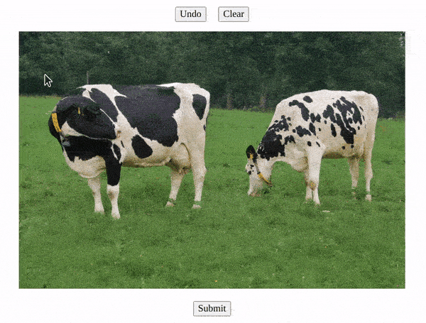

# Rectangle Annotate

Annotate images by drawing rectangles on it. Coordinates of drawn reactangles can also be added to a form whose values can be sent to a server to save to a database for use later use (redrawing another time) or doing some operations on annotated parts of the image. eg. cropping, etc.



[See Live Demo](https://harisrahman.github.io/rect-annotate/)

## Usage


### Basic use 

HTML:

```html

```

JS :

```js
new RectAnnotate("#myImage");
```

### Use undo and clear buttons

You will have to add the undo and clear 

```html
	<button id="undoRectAnnotate" type="button">Undo</button>
	<button id="clearRectAnnotate" type="button">Clear</button>
```

By default undoRectAnnotate and clearRectAnnotate button ids are expected to be for undo and clear buttons respectively. If you want to use any other selector then you may pass it in configuration object during intialisation.

```js
	new RectAnnotate("#image", {
		undoBtn: "#myUndoBtn",
		form: "#myForm",
	});
```

### Keyboard shortcuts

You can also use keyboard shortcuts : 

`Undo` : `Ctrl+Z`

`Clear` : `Ctrl+B`

## Configuration

Configuration can be set by passing an object as second parameter during intialisation.

```js
	new RectAnnotate("#image", {
		color: "#ccc",
	});
```

| Property 					| Value 											| Default					|
| ------------------------- | ------------------------------------------------- | ------------------------- |
|`color`					| `string`											|	`"#000"`				|
|`strokeWidth`				| `number`											|	`3`						|
|`minHeight`				| `number`											|	`5`						|
|`minWidth`					| `number`											|	`5`						|
|`clearBtn`					| `string`											|	`"#clearRectAnnotate"`	|
|`undoBtn`					| `string`											|	`"#undoRectAnnotate"`	|
|`form`						| `string \| null` 									|	`"#rectAnnotateForm"`	|
|`inputName`				| `string`											|	`"coords"`				|
|`actualImageSizeInCoords`	| `boolean`											|	`true`					|
|`allowOverlap`				| `boolean`											|	`false`					|
|`keyboardShortcuts`		| `boolean`											|	`true`					|
|`load`						| `Array<[number, number, number, number]> \| null` |	`null`					|